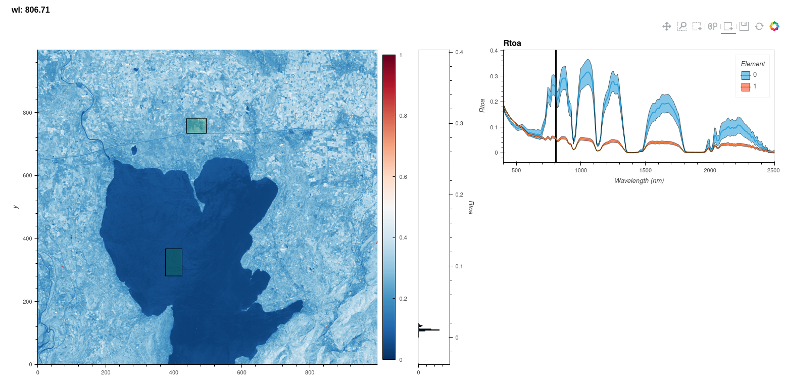
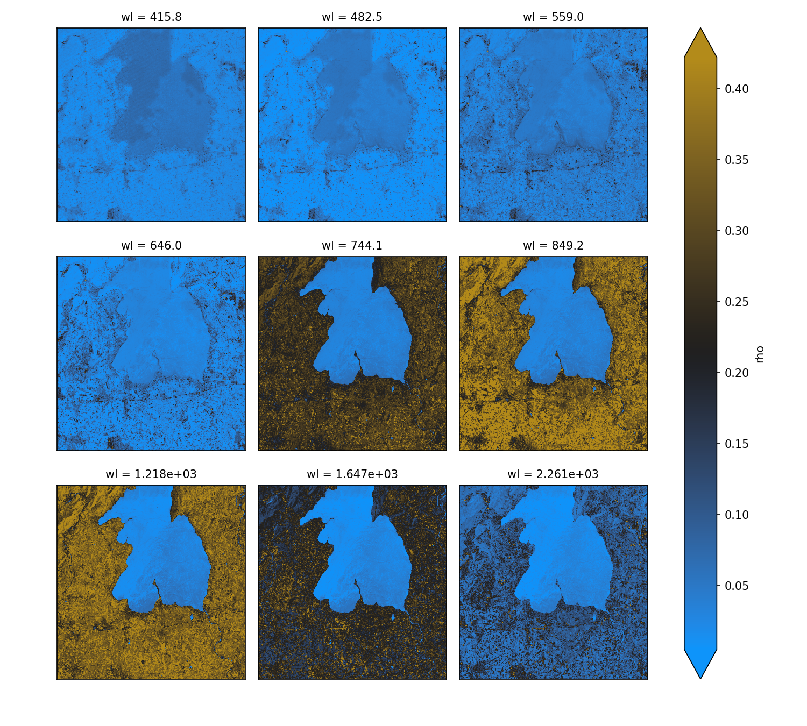
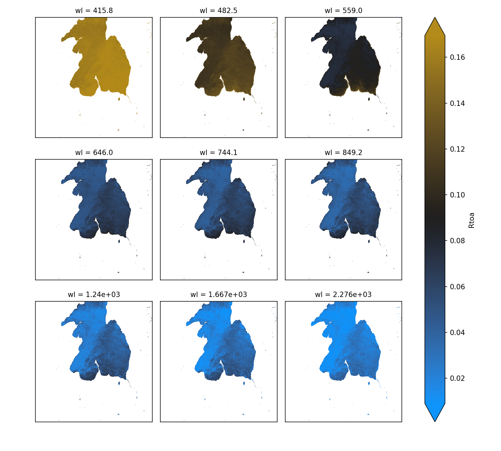

# hGRS package
## Hyperspectral Glint Removal System for hyperspectral remote sensing of the aquatic environment

# WARNING: this is a working version between collaborators please do not use it as is. Stable version will come soon.

### Prerequisites

If you want to get visualization tool, you first need to install the following libraries (more secure with Anaconda):

```
conda install -c conda-forge hvplot bokeh panel datashader jupyter jupyterlab
```

### Installing

First, clone [the repository](https://github.com/Tristanovsk/prismapy#) and execute the following command in the
local copy:

```
pip install . 
```


## Examples






