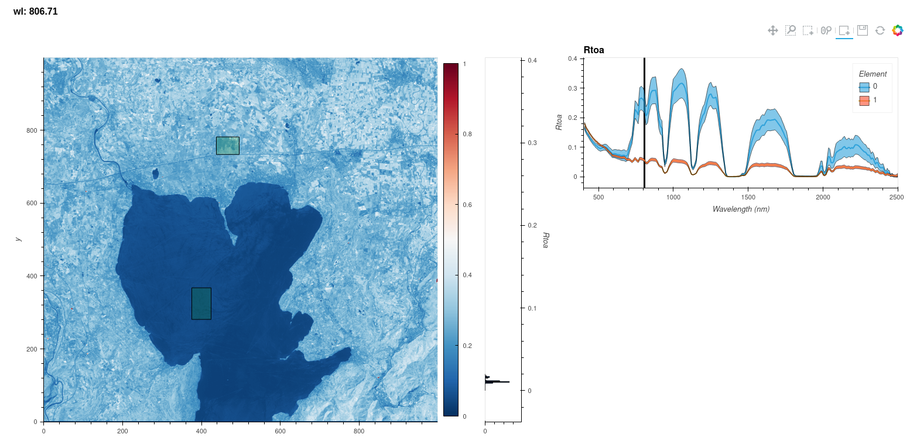
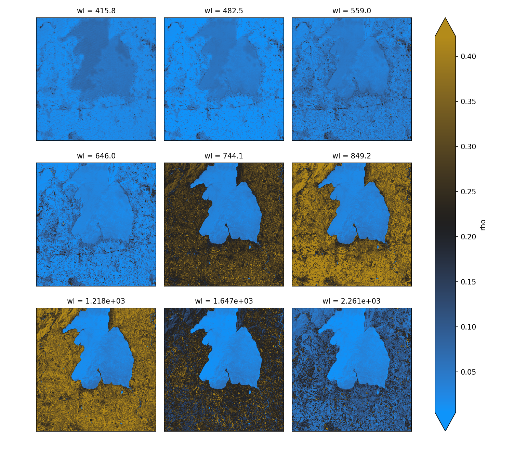
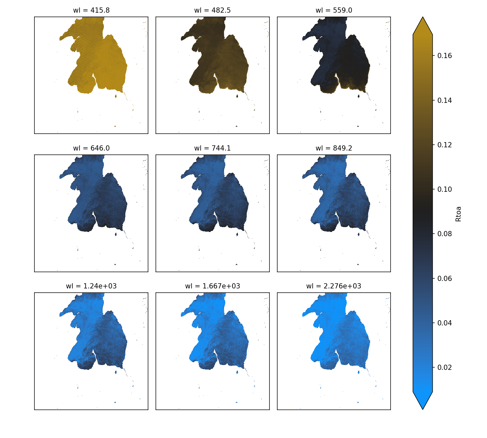

# hGRS package
## Hyperspectral Glint Removal System for hyperspectral remote sensing of the aquatic environment

# WARNING: this is a working version between collaborators please do not use it as is. Stable version will come soon.

### Prerequisites

If you want to get visualization tool, you first need to install the following libraries (more secure with Anaconda):

```
conda install -c conda-forge hvplot bokeh panel datashader jupyter jupyterlab
```

### Installing

First, clone [the repository](https://github.com/Tristanovsk/prismapy#) and execute the following command in the
local copy:

```
pip install . 
```

Then, download the look-up table (LUT) files and copy them in a specific folder (get the path of this folder). 

[download lut](https://drive.google.com/drive/folders/1r3unjh8UYTvO87nbppqivVq_cwbVxhLk?usp=sharing)

Write the path of the LUT folder in `hgrs/config.yml`, example:
```commandline
path:
  data_root: '/DATA/git/satellite_app/hgrs/big_lut'
```

Optional dependency, if you want to use the reprojection feature for PRISMA please install xemsf:

```commandline
conda install xesmf
```

## Examples






