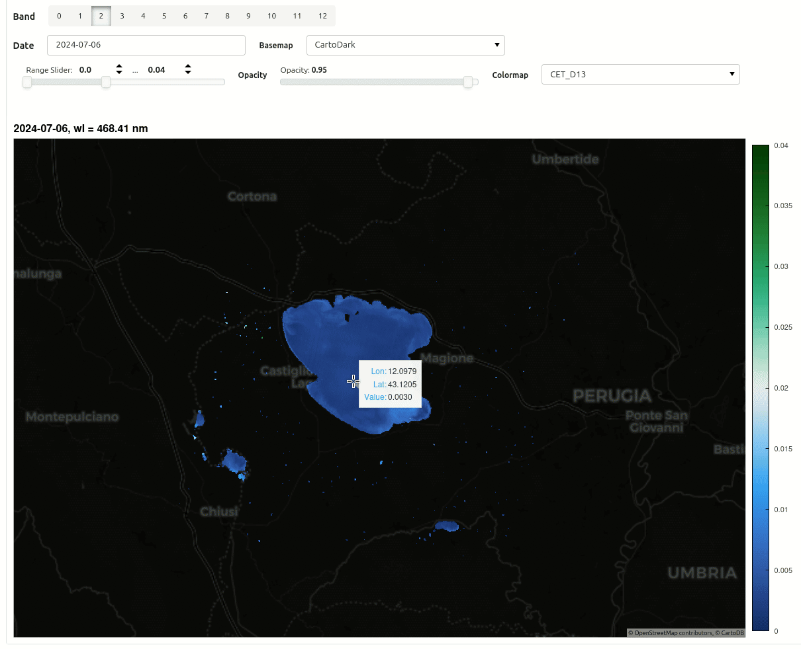

.. hgrs documentation master file, created by
   sphinx-quickstart on Mon Jun 22 13:19:49 2026.
   You can adapt this file completely to your liking, but it should at least
   contain the root `toctree` directive.

hGRS documentation
==================

The atmospheric correction processor hGRS is dedicated to water-leaving radiance retrieval from Hyperspectral satelite images possensing visible to SWIR spectral acquisition.
hGRS is capable of retrieving the aerosol content, water vapor, sunglint and water-leaving radiance from a non-linear optimization solver.
The algorithm is mainly based on pre-computed simulations of the fully coupled water-atmosphere
radiative transfer and a constrained non-linear optimization scheme enabling to impose
the non-negativity property of the retrieved water reflectances.

- Drivers fully implemented for PRISMA and EnMAP, with automatic geoprojection of PRISMA L1C/L2D images
- Cloud masking based on OmniCloudMask
- Output images are provided in netcdf(soon ZARR) format with specific compression enabling a significant reduction of the file size.

.. toctree::
   :maxdepth: 3
   :caption: Getting started:

   usage

.. toctree::
   :maxdepth: 2
   :caption: Tutorials

   tutorials/basics

.. toctree::
   :maxdepth: 3
   :caption: hGRS API
   :hidden:

   api

API reference
-------------

.. autosummary::
   :template: custom-module-template.rst

.. toctree::
   :maxdepth: 1
   :caption: For Contributors
   :hidden:

   history

Interactive data manipulation
=============================

Please see the GRS Toolbox package `grstbx <https://github.com/Tristanovsk/grstbx>`__

Indices and tables
==================

* :ref:`genindex`
* :ref:`modindex`
* :ref:`search`