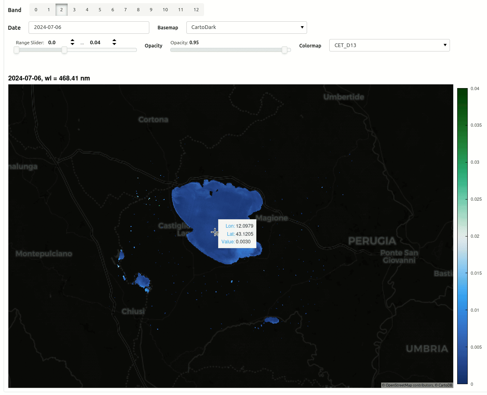

hGRS documentation
==================

hGRS (hyperspectral Glint Removal System)
-----------------------------------------

hGRS is an atmospheric correction processor dedicated to the retrieval of the water-leaving radiance
from hyperspectral satellite images covering the visible to the SWIR (PRISMA, EnMAP). From the
top-of-atmosphere reflectance, it retrieves successively:

- the absorption by the atmospheric gases, including the water vapor column fitted on the image,
- the aerosol optical thickness and the sunglint, by a constrained non-linear optimization that keeps
  the retrieved water reflectance non-negative,

to compute the remote-sensing reflectance :math:`R_{rs}` at the water surface. The algorithm relies on
pre-computed simulations of the fully coupled water-atmosphere radiative transfer (look-up tables) and
on the CAMS atmospheric composition.

- Drivers for PRISMA and EnMAP, with automatic geoprojection of the PRISMA L1 images
- Cloud and cloud shadow masking with `OmniCloudMask <https://github.com/DPIRD-DMA/OmniCloudMask>`__
- Compressed NetCDF output

.. code-block:: bash

   hgrs_enmap ENMAP01-____L1C-DT0000001234_20240701T103000Z_001_V010400_20240702T000000Z \
       --cams_file cams_2024-07.nc --odir ./L2A

.. toctree::
   :maxdepth: 2
   :caption: User guide

   installation
   usage
   methods

.. toctree::
   :maxdepth: 2
   :caption: Tutorials

   tutorials/basics

.. toctree::
   :maxdepth: 2
   :caption: Reference

   api
   history

Interactive data manipulation
-----------------------------

See the GRS toolbox package `grstbx <https://github.com/Tristanovsk/grstbx>`__.

Indices and tables
------------------

* :ref:`genindex`
* :ref:`modindex`
* :ref:`search`
